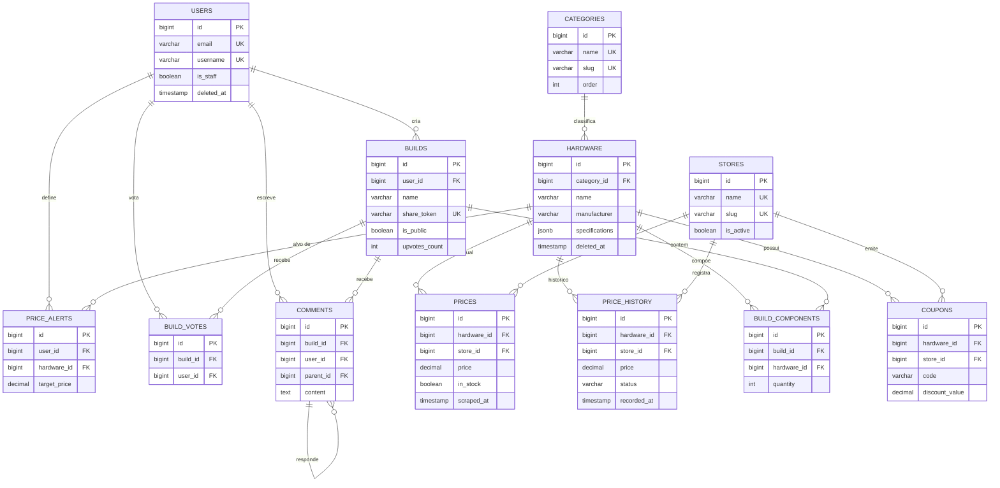

# Modelagem de Banco de Dados - Hardware Tracker

**Status:** Revisado — Sessão 2026-05-22
**Última Atualização:** 2026-05-22
**Versão:** 0.3
**SGBD:** PostgreSQL 13+

---

## 1. Diagrama ER (Entidade-Relacionamento)



---

## 2. Tabelas Principais

### 2.1 Users

```sql
CREATE TABLE users (
    id               BIGSERIAL PRIMARY KEY,
    email            VARCHAR(255) UNIQUE NOT NULL,
    username         VARCHAR(100) UNIQUE NOT NULL,
    password_hash    VARCHAR(255) NOT NULL,
    first_name       VARCHAR(100),
    last_name        VARCHAR(100),
    avatar_url       VARCHAR(500),
    bio              TEXT,
    telegram_chat_id VARCHAR(100) NULL,       -- alertas de preço via bot Telegram (Could Have)
    is_active        BOOLEAN DEFAULT TRUE,
    is_staff         BOOLEAN DEFAULT FALSE,
    created_at       TIMESTAMP DEFAULT CURRENT_TIMESTAMP,
    updated_at       TIMESTAMP DEFAULT CURRENT_TIMESTAMP,
    deleted_at       TIMESTAMP NULL
);

CREATE INDEX idx_users_email    ON users(email);
CREATE INDEX idx_users_username ON users(username);
```

### 2.2 Categories

```sql
CREATE TABLE categories (
    id          BIGSERIAL PRIMARY KEY,
    name        VARCHAR(100) NOT NULL UNIQUE,
    slug        VARCHAR(100) NOT NULL UNIQUE,
    description TEXT,
    icon_url    VARCHAR(500),
    "order"     INT DEFAULT 0,
    created_at  TIMESTAMP DEFAULT CURRENT_TIMESTAMP
);

CREATE INDEX idx_categories_slug ON categories(slug);
```

### 2.3 Hardware

```sql
CREATE TABLE hardware (
    id             BIGSERIAL PRIMARY KEY,
    name           VARCHAR(255) NOT NULL,
    category_id    BIGINT NOT NULL REFERENCES categories(id),
    manufacturer   VARCHAR(100),
    model          VARCHAR(100),
    sku            VARCHAR(100),
    specifications JSONB,   -- specs técnicas variáveis por categoria (ver seção 6)
    image_url      VARCHAR(500),
    description    TEXT,
    created_at     TIMESTAMP DEFAULT CURRENT_TIMESTAMP,
    updated_at     TIMESTAMP DEFAULT CURRENT_TIMESTAMP,
    deleted_at     TIMESTAMP NULL
);

CREATE INDEX idx_hardware_category     ON hardware(category_id);
CREATE INDEX idx_hardware_manufacturer ON hardware(manufacturer);
CREATE INDEX idx_hardware_specs        ON hardware USING GIN (specifications);
```

### 2.4 Stores

```sql
CREATE TABLE stores (
    id         BIGSERIAL PRIMARY KEY,
    name       VARCHAR(100) NOT NULL UNIQUE,
    slug       VARCHAR(100) NOT NULL UNIQUE,
    url        VARCHAR(500),
    logo_url   VARCHAR(500),
    is_active  BOOLEAN DEFAULT TRUE,
    created_at TIMESTAMP DEFAULT CURRENT_TIMESTAMP,
    updated_at TIMESTAMP DEFAULT CURRENT_TIMESTAMP
);

-- Seed inicial: Terabyte, KaBuM!, Amazon Brasil, Pichau
```

### 2.5 Prices (preço atual por loja)

```sql
CREATE TABLE prices (
    id             BIGSERIAL PRIMARY KEY,
    hardware_id    BIGINT NOT NULL REFERENCES hardware(id),
    store_id       BIGINT NOT NULL REFERENCES stores(id),
    price          DECIMAL(10,2) NOT NULL,
    original_price DECIMAL(10,2),
    in_stock       BOOLEAN DEFAULT TRUE,
    product_url    VARCHAR(500),
    scraped_at     TIMESTAMP DEFAULT CURRENT_TIMESTAMP,
    updated_at     TIMESTAMP DEFAULT CURRENT_TIMESTAMP,

    UNIQUE(hardware_id, store_id)
);

CREATE INDEX idx_prices_hardware ON prices(hardware_id);
CREATE INDEX idx_prices_store    ON prices(store_id);
CREATE INDEX idx_prices_updated  ON prices(updated_at DESC);
```

### 2.6 PriceHistory

```sql
-- Decisão: scraping diário (1 registro por hardware/loja/dia).
-- Quando a peça fica sem estoque: status = 'unavailable', price = null.
-- Isso alimenta o gráfico com segmento cinza "Indisponível" (US-24).

CREATE TABLE price_history (
    id          BIGSERIAL PRIMARY KEY,
    hardware_id BIGINT NOT NULL REFERENCES hardware(id),
    store_id    BIGINT NOT NULL REFERENCES stores(id),
    price       DECIMAL(10,2) NULL,                        -- null quando indisponível
    status      VARCHAR(20) NOT NULL DEFAULT 'available',  -- 'available' | 'unavailable'
    currency    VARCHAR(3) DEFAULT 'BRL',
    recorded_at TIMESTAMP DEFAULT CURRENT_TIMESTAMP
);

CREATE INDEX idx_price_history_hardware_date ON price_history(hardware_id, recorded_at DESC);
CREATE INDEX idx_price_history_store_date    ON price_history(store_id, recorded_at DESC);
CREATE INDEX idx_price_history_date          ON price_history(recorded_at DESC);
```

### 2.7 Builds

```sql
CREATE TABLE builds (
    id            BIGSERIAL PRIMARY KEY,
    user_id       BIGINT NOT NULL REFERENCES users(id),
    name          VARCHAR(255) NOT NULL,
    description   TEXT,
    use_type      VARCHAR(50) NULL,            -- 'gaming', 'work', 'streaming', 'office' (US-41)
    share_token   VARCHAR(64) UNIQUE NULL,     -- token para URL pública compartilhável (US-34)
    total_price   DECIMAL(12,2),
    is_public     BOOLEAN DEFAULT FALSE,
    upvotes_count INT DEFAULT 0,               -- contador denormalizado para performance
    views_count   INT DEFAULT 0,
    created_at    TIMESTAMP DEFAULT CURRENT_TIMESTAMP,
    updated_at    TIMESTAMP DEFAULT CURRENT_TIMESTAMP,
    deleted_at    TIMESTAMP NULL
);

CREATE INDEX idx_builds_user        ON builds(user_id);
CREATE INDEX idx_builds_public_date ON builds(is_public, created_at DESC);
CREATE INDEX idx_builds_upvotes     ON builds(is_public, upvotes_count DESC);
CREATE INDEX idx_builds_share_token ON builds(share_token) WHERE share_token IS NOT NULL;
CREATE INDEX idx_builds_use_type    ON builds(use_type) WHERE is_public = TRUE;
```

### 2.8 BuildComponents

```sql
CREATE TABLE build_components (
    id                BIGSERIAL PRIMARY KEY,
    build_id          BIGINT NOT NULL REFERENCES builds(id) ON DELETE CASCADE,
    hardware_id       BIGINT NOT NULL REFERENCES hardware(id),
    quantity          INT DEFAULT 1,
    price_at_creation DECIMAL(10,2),   -- preço no momento da criação da build
    created_at        TIMESTAMP DEFAULT CURRENT_TIMESTAMP,

    UNIQUE(build_id, hardware_id)
);

CREATE INDEX idx_build_components_build ON build_components(build_id);
```

### 2.9 BuildVotes

```sql
-- US-43: 1 voto por usuário por build, removível.
-- upvotes_count em builds é atualizado via trigger ou na camada de serviço.

CREATE TABLE build_votes (
    id         BIGSERIAL PRIMARY KEY,
    build_id   BIGINT NOT NULL REFERENCES builds(id) ON DELETE CASCADE,
    user_id    BIGINT NOT NULL REFERENCES users(id) ON DELETE CASCADE,
    created_at TIMESTAMP DEFAULT CURRENT_TIMESTAMP,

    UNIQUE(build_id, user_id)
);

CREATE INDEX idx_build_votes_build ON build_votes(build_id);
CREATE INDEX idx_build_votes_user  ON build_votes(user_id);
```

### 2.10 Comments

```sql
CREATE TABLE comments (
    id          BIGSERIAL PRIMARY KEY,
    build_id    BIGINT NOT NULL REFERENCES builds(id) ON DELETE CASCADE,
    user_id     BIGINT NOT NULL REFERENCES users(id),
    parent_id   BIGINT REFERENCES comments(id) ON DELETE CASCADE,  -- respostas aninhadas
    content     TEXT NOT NULL,
    likes_count INT DEFAULT 0,
    created_at  TIMESTAMP DEFAULT CURRENT_TIMESTAMP,
    updated_at  TIMESTAMP DEFAULT CURRENT_TIMESTAMP,
    deleted_at  TIMESTAMP NULL
);

CREATE INDEX idx_comments_build ON comments(build_id);
CREATE INDEX idx_comments_user  ON comments(user_id);
CREATE INDEX idx_comments_date  ON comments(created_at DESC);
```

### 2.11 Coupons

```sql
-- Cupons coletados via scraping, vinculados a um produto em uma loja específica.
-- Acesso restrito a usuários logados (US-27).

CREATE TABLE coupons (
    id             BIGSERIAL PRIMARY KEY,
    hardware_id    BIGINT NOT NULL REFERENCES hardware(id) ON DELETE CASCADE,
    store_id       BIGINT NOT NULL REFERENCES stores(id) ON DELETE CASCADE,
    code           VARCHAR(100) NOT NULL,
    discount_type  VARCHAR(20) NOT NULL DEFAULT 'percentage', -- 'percentage' | 'fixed'
    discount_value DECIMAL(10,2) NOT NULL,
    valid_until    TIMESTAMP NULL,
    is_active      BOOLEAN DEFAULT TRUE,
    created_at     TIMESTAMP DEFAULT CURRENT_TIMESTAMP,
    updated_at     TIMESTAMP DEFAULT CURRENT_TIMESTAMP
);

CREATE INDEX idx_coupons_hardware ON coupons(hardware_id) WHERE is_active = TRUE;
CREATE INDEX idx_coupons_store    ON coupons(store_id) WHERE is_active = TRUE;
```

### 2.12 PriceAlerts (Could Have)

```sql
-- US-26: usuário define preço-alvo; bot Telegram notifica quando atingido.

CREATE TABLE price_alerts (
    id           BIGSERIAL PRIMARY KEY,
    user_id      BIGINT NOT NULL REFERENCES users(id) ON DELETE CASCADE,
    hardware_id  BIGINT NOT NULL REFERENCES hardware(id) ON DELETE CASCADE,
    target_price DECIMAL(10,2) NOT NULL,
    is_active    BOOLEAN DEFAULT TRUE,
    triggered_at TIMESTAMP NULL,
    created_at   TIMESTAMP DEFAULT CURRENT_TIMESTAMP,

    UNIQUE(user_id, hardware_id)
);

CREATE INDEX idx_price_alerts_user     ON price_alerts(user_id);
CREATE INDEX idx_price_alerts_hardware ON price_alerts(hardware_id) WHERE is_active = TRUE;
```

---

## 3. Compatibilidade — Abordagem via JSONB

**Decisão:** Não usar tabela de pares `(from_hardware_id, to_hardware_id)` — essa abordagem é O(n²) e não escala com o catálogo.

A compatibilidade é verificada no backend Django comparando os campos `specifications` JSONB de cada peça selecionada na build. As regras implementadas no MVP:

| Regra                       | Campo specs (peça A)                 | Comparação | Campo specs (peça B)                             |
| --------------------------- | ------------------------------------- | ------------ | ------------------------------------------------- |
| Socket CPU ↔ Placa-mãe    | `cpu.specs->>'socket'`              | ==           | `motherboard.specs->>'socket'`                  |
| Tipo RAM ↔ Placa-mãe      | `ram.specs->>'ddr_type'`            | ==           | `motherboard.specs->>'ddr_type'`                |
| TDP CPU ≤ Cooler           | `cpu.specs->>'tdp'` (int)           | <=           | `cooler.specs->>'tdp_capacity'` (int)           |
| Consumo total ≤ Fonte      | soma TDP de todas as peças           | <=           | `psu.specs->>'wattage'` × 0.7                  |
| Form factor ↔ Gabinete     | `motherboard.specs->>'form_factor'` | compatível  | `case.specs->>'supported_form_factors'` (array) |
| Comprimento GPU ≤ Gabinete | `gpu.specs->>'length_mm'` (int)     | <=           | `case.specs->>'max_gpu_length_mm'` (int)        |

**Specs JSONB por categoria (exemplos):**

```json
// CPU
{ "socket": "AM5", "tdp": 65, "ddr_type": "DDR5", "cores": 8, "boost_clock_ghz": 5.0 }

// Motherboard
{ "socket": "AM5", "ddr_type": "DDR5", "form_factor": "ATX", "has_wifi": true, "has_bluetooth": true }

// GPU
{ "tdp": 200, "length_mm": 336, "vram_gb": 12, "power_connector": "16-pin" }

// RAM
{ "ddr_type": "DDR5", "capacity_gb": 16, "speed_mhz": 6000, "sticks": 2 }

// PSU
{ "wattage": 750, "certification": "80+ Gold" }

// Case
{ "supported_form_factors": ["ATX", "mATX", "ITX"], "max_gpu_length_mm": 400, "max_cooler_height_mm": 165 }

// Cooler
{ "socket_support": ["AM4", "AM5", "LGA1700"], "tdp_capacity": 250, "height_mm": 158 }
```

---

## 4. Constraints e Validações

| Tabela           | Campo                  | Constraint                      | Descrição                     |
| ---------------- | ---------------------- | ------------------------------- | ------------------------------- |
| users            | email                  | UNIQUE NOT NULL                 | Email único por conta          |
| hardware         | name                   | NOT NULL                        | Nome obrigatório               |
| prices           | price                  | > 0                             | Preço atual sempre positivo    |
| price_history    | status                 | IN ('available', 'unavailable') | Validado na camada Django       |
| builds           | user_id                | FK NOT NULL                     | Build deve ter dono             |
| build_components | quantity               | > 0                             | Quantidade mínima 1            |
| build_votes      | (build_id, user_id)    | UNIQUE                          | 1 voto por usuário por build   |
| price_alerts     | (user_id, hardware_id) | UNIQUE                          | 1 alerta por peça por usuário |

---

## 5. Índices

| Índice                         | Tabela        | Colunas                               | Razão                            |
| ------------------------------- | ------------- | ------------------------------------- | --------------------------------- |
| idx_users_email                 | users         | email                                 | Login por email                   |
| idx_hardware_category           | hardware      | category_id                           | Filtro por categoria no catálogo |
| idx_hardware_specs              | hardware      | specifications (GIN)                  | Queries JSONB de compatibilidade  |
| idx_prices_updated              | prices        | updated_at DESC                       | Preços mais recentes             |
| idx_price_history_hardware_date | price_history | hardware_id, recorded_at DESC         | Gráfico de histórico            |
| idx_builds_public_date          | builds        | is_public, created_at DESC            | Ranking "Recentes"                |
| idx_builds_upvotes              | builds        | is_public, upvotes_count DESC         | Ranking "Populares"               |
| idx_builds_use_type             | builds        | use_type (parcial: is_public=TRUE)    | Filtro por uso na comunidade      |
| idx_build_votes_build           | build_votes   | build_id                              | Contagem de votos por build       |
| idx_price_alerts_hardware       | price_alerts  | hardware_id (parcial: is_active=TRUE) | Verificação diária de alertas  |

---

## 6. Queries Comuns

### 6.1 Preço mais barato para um hardware

```sql
SELECT h.name, s.name AS store, p.price, p.product_url
FROM prices p
JOIN hardware h ON p.hardware_id = h.id
JOIN stores s   ON p.store_id = s.id
WHERE h.id = $1
  AND p.in_stock = TRUE
ORDER BY p.price ASC
LIMIT 1;
```

### 6.2 Histórico de preços com períodos de indisponibilidade

```sql
SELECT store_id, price, status, recorded_at
FROM price_history
WHERE hardware_id = $1
  AND recorded_at >= NOW() - INTERVAL '90 days'
ORDER BY store_id, recorded_at ASC;
-- status = 'unavailable' → gráfico exibe segmento cinza com tooltip "Indisponível"
```

### 6.3 Melhor preço histórico e média dos últimos 30 dias

```sql
SELECT
    MIN(price)  FILTER (WHERE status = 'available') AS min_price_ever,
    AVG(price)  FILTER (WHERE status = 'available'
                          AND recorded_at >= NOW() - INTERVAL '30 days') AS avg_30d
FROM price_history
WHERE hardware_id = $1
  AND store_id    = $2;
```

### 6.4 Ranking de builds populares com filtro por uso

```sql
SELECT b.*, u.username, u.avatar_url
FROM builds b
JOIN users u ON b.user_id = u.id
WHERE b.is_public = TRUE
  AND ($1::VARCHAR IS NULL OR b.use_type = $1)   -- filtro opcional por uso
ORDER BY b.upvotes_count DESC
LIMIT 20 OFFSET $2;
```

### 6.5 Verificar se usuário já votou em uma build

```sql
SELECT 1 FROM build_votes
WHERE build_id = $1 AND user_id = $2
LIMIT 1;
```

### 6.6 Builds com alertas ativos para um hardware (verificação diária)

```sql
SELECT pa.user_id, pa.target_price, u.telegram_chat_id, p.price AS current_price
FROM price_alerts pa
JOIN users   u ON pa.user_id    = u.id
JOIN prices  p ON pa.hardware_id = p.hardware_id
WHERE pa.hardware_id = $1
  AND pa.is_active   = TRUE
  AND p.price       <= pa.target_price;
```

---

## 7. Decisões de Design

### 7.1 JSONB para Especificações Técnicas

Hardware de categorias diferentes tem atributos completamente distintos (CPU tem socket/TDP/cores, gabinete tem form_factor/max_gpu_length). Usar JSONB evita ~30 colunas nulas por linha e elimina a necessidade de uma tabela por categoria. O GIN index (`idx_hardware_specs`) torna queries em campos específicos do JSONB eficientes.

### 7.2 Compatibilidade via Specs (sem tabela de regras)

A abordagem de tabela `(from_hardware_id, to_hardware_id)` seria O(n²) — inviável com um catálogo de milhares de peças. A verificação via comparação de specs JSONB no backend Django é determinística, instantânea e escalável.

### 7.3 price_history com campo status

Quando uma peça fica sem estoque, registramos `status = 'unavailable'` com `price = null` — em vez de simplesmente não registrar. Isso preserva a continuidade da série temporal e permite que o gráfico mostre explicitamente os períodos de indisponibilidade.

### 7.4 Soft Delete (deleted_at)

Aplicado em `users`, `hardware`, `builds` e `comments`. Facilita auditoria, evita cascatas acidentais e permite recuperação de dados.

### 7.5 Denormalização de Contadores

`builds.upvotes_count` e `comments.likes_count` são contadores denormalizados. Evitam `COUNT(*)` em tempo de query para rankings. São atualizados na camada de serviço Django ao votar/desvotar.

### 7.6 Frequência de Scraping

Diária — 1 registro por `(hardware_id, store_id)` por dia na `price_history`. O job é orquestrado via Celery Beat ou n8n às 03:00 BRT.

---

## 8. Migrations (Django)

```bash
python manage.py makemigrations hardware builds community scraping
python manage.py migrate
```

Apps Django planejados e suas tabelas principais:

| App Django                   | Tabelas                                                    |
| ---------------------------- | ---------------------------------------------------------- |
| `hardware`                 | hardware, categories, stores, prices, price_history        |
| `builds`                   | builds, build_components, build_votes                      |
| `community`                | comments                                                   |
| `users` (auth customizado) | users                                                      |
| `scraping`                 | (sem models próprios — lê/escreve em hardware e prices) |
| `alerts`                   | price_alerts                                               |
| `scraping`                 | coupons (coleta junto com preços)                         |

---

## 9. Próximos Passos

1. [X] Revisar e alinhar esquema com User Stories e decisões de sessão
2. [X] Modelagem discutida e validada com Guilherme — sessão 2026-05-22
3. [ ] Implementar models.py Django por app
4. [ ] Criar migrations e rodar em ambiente local (Docker)
5. [ ] Criar fixtures de seed (categorias, lojas, hardware populares)
6. [ ] Testar queries de performance com EXPLAIN ANALYZE
7. [ ] Configurar pgvector se RAG for implementado (Post-MVP)

---

## 10. Referências

- [PostgreSQL JSONB](https://www.postgresql.org/docs/current/datatype-json.html)
- [PostgreSQL GIN Indexes](https://www.postgresql.org/docs/current/gin.html)
- [Django Models](https://docs.djangoproject.com/en/stable/topics/db/models/)
- [Database Normalization](https://en.wikipedia.org/wiki/Database_normalization)
